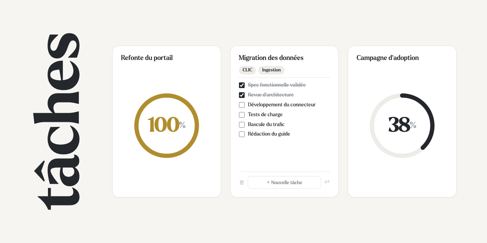

# tâches

Un tableau de bord de suivi d'avancement qui tient dans **une seule page HTML
autonome** : pas de serveur, pas de dépendance, pas de build à installer. Un
fichier que l'on ouvre, que l'on envoie par mail ou que l'on publie tel quel.



## Fonctionnalités

### Les cartes

- **Deux faces.** Le recto porte une jauge circulaire d'avancement, le verso la
  liste des tâches qui la composent. On bascule en cliquant sur la carte.
- **Jauge réglable directement** : on clique ou on glisse sur l'anneau pour
  fixer le pourcentage, avec un repère qui suit le pointeur. Les flèches du
  clavier l'ajustent par pas de 5.
- **Cases à cocher** : cocher une tâche recalcule le pourcentage de la carte.
- **Cartes mères et filles.** En glissant une carte sur le verso d'une autre,
  on la rattache. La jauge d'une carte mère devient dérivée : c'est la moyenne
  de ses filles, calculée récursivement, et elle n'est plus réglable à la main.
  Les cycles sont refusés.
- **Réordonnancement** par glisser-déposer, à partir de la poignée.
- **Suppression en deux temps** : la corbeille arme la confirmation, qui prend
  la place du bouton d'ajout. Supprimer une carte mère détache ses filles au
  lieu de les emporter.

### L'affichage

- **Tags et filtres.** Chaque carte porte des tags ; le panneau de filtres se
  déplie depuis l'entonnoir, sans décaler la grille. Un compteur signale les
  filtres actifs même une fois le panneau replié.
- **Densité de grille** réglable : automatique, ou 2 à 5 colonnes.
- **Export et import.** Le panneau de réglages écrit un fichier JSON de toutes
  les cartes, et sait le relire pour les restaurer ailleurs ou revenir en
  arrière. À la relecture, chaque carte est vérifiée et corrigée — types,
  pourcentages hors bornes, rattachements vers une carte absente — plutôt que
  reprise telle quelle.
- **Trois langues** — français, anglais, arabe — au choix dans les réglages.
  L'arabe bascule la page en lecture de droite à gauche ; son titre y passe à
  l'horizontale, l'écriture cursive ne supportant pas la bande verticale.
- **Thème clair, sombre ou système.** « Système » suit le réglage du navigateur
  et réagit s'il change en cours de session.
- **Page monochrome**, à deux exceptions près : le doré d'une jauge pleine et
  le cœur de la signature.
- **Responsive** : sous 760 px, le titre repasse à l'horizontale et la grille
  à une colonne.

### Accessibilité

L'anneau est un `slider` ARIA pilotable au clavier ; les panneaux repliés sont
`inert`, donc hors du parcours de tabulation ; les icônes ont leur équivalent
textuel ; les animations sont neutralisées sous `prefers-reduced-motion`.

## Utiliser la page

Le fichier publiable n'est pas versionné — il est reconstruit à la demande :

```bash
./build.sh          # produit dist/tasks.html
open dist/tasks.html
```

`build.sh` recompose les sources en un fichier unique et y injecte la version,
le hash du commit et l'URL du dépôt, lisibles dans le panneau de réglages.

> **Persistance.** Le travail est conservé d'une visite à l'autre, y compris
> en ouverture locale : la page écrit dans le dépôt de son hôte quand elle est
> hébergée, et retombe sur `localStorage` sinon. Les données restent donc
> attachées au navigateur — un autre poste, un autre navigateur ou une fenêtre
> privée repartent des cartes de démonstration. Pour les déplacer, passez par
> l'export.

## Organisation des fichiers

| Chemin | Rôle |
| --- | --- |
| `src/index.html` | structure de la page et marqueurs d'assemblage |
| `src/styles.css` | feuille de styles complète |
| `src/app.js` | modèle de données, rendu et interactions |
| `src/i18n.js` | dictionnaires français, anglais et arabe |
| `src/fonts.css` | fontes Larken en base64 |
| `src/logo.css`, `src/favicon.html` | images en base64 |
| `build.sh` | assemble le tout dans `dist/tasks.html` |
| `assets/` | sources des images, avant encodage |
| `VERSION` | numéro de version affiché dans les réglages |

Les sources sont éclatées pour rester lisibles — le fichier final, lui, doit
être autonome, d'où l'assemblage.

### Contribuer

Un hook reconstruit `dist/` après chaque commit, pour que le hash affiché dans
la page soit toujours celui du commit courant. À activer une fois par clone :

```bash
git config core.hooksPath .githooks
```

## Polices

La page est composée en **Larken**, une fonte tierce embarquée en base64. Elle
n'est pas couverte par la licence de ce dépôt : vérifiez ses conditions
d'utilisation avant de réemployer le projet ailleurs.
